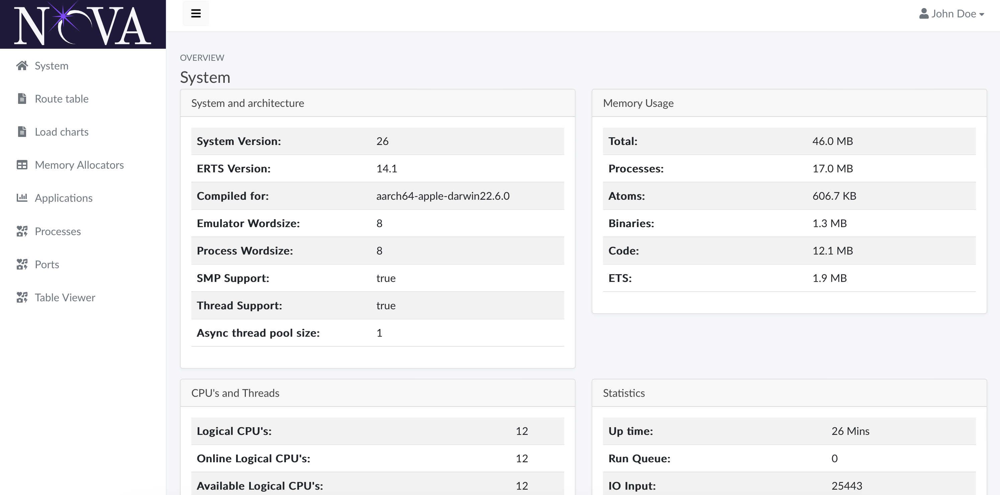

# nova_admin
Observer-like administration UI for Nova




Clone and try it out. Please report bugs if you find. Any help is welcome (Bug reports, contributions etc).

## Installation

Add nova_admin to your *rebar.config*:

```erlang
{deps, [
    {nova_admin, ".*", {git, "git@github.com:novaframework/nova_admin.git", {branch, "master"}}}
]}.
```

Update your config file to include nova_admin:

```erlang
{your_application, [
    {nova_apps, [
        {nova_admin, #{prefix => "/nova_admin"}}
    ]}
]}.
```

Change `your_application` to the name of your application and `prefix` to the desired prefix for nova_admin.
